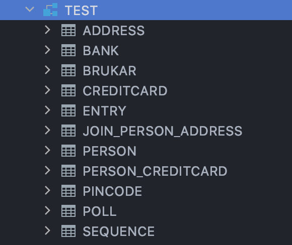

# Assignment 2

- Technical problems that you encountered during installation and use of Java Persistence Architecture (JPA) and how you resolved
    - I had a driver issue when trying to inspect the database in intellij. This was fixed by going through the external libraries added by maven, and choosing the derbytools.jar/embeddedDriver.class.
    - I had trouble having JPA/JDBC create the tables, so i initially did so using sql. I later found out that the line below was commented out in META-INF/persistence.xml
            
            <property name="eclipselink.ddl-generation" value="create-tables" />
    
- A link to your code for experiment 1 and 2 above
    - expass2/

- An explanation of how you inspected the database tables and what tables were created. For the latter you may provide screenshots.
    - I used intellij's Database inspection tool. 
    

- Any pending issues with this assignment which you did not manage to solve
    - No pending issues