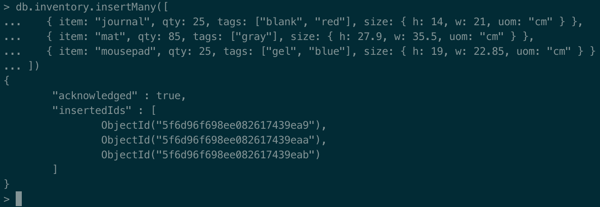
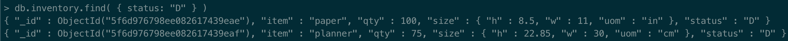
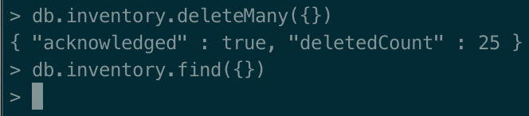
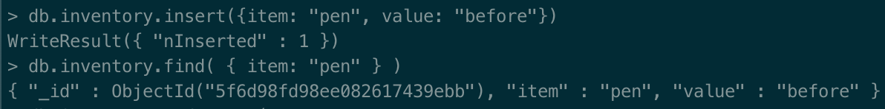
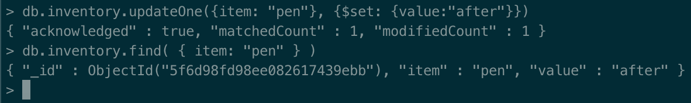
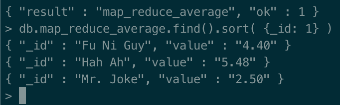

# Assignment 3

- Technical problems that you encountered during installation and use of MongoDB and how you resolved
  
- Screenshots for:
    - The correct validation of the installation package (https://docs.mongodb.com/manual/tutorial/verify-mongodb-packages/)
    - Relevant results obtained during Experiment 1 (it is not necessary to put a single screenshot on each substep, but at least one significant from each CRUD operation).
    
    
    
    
    
    - Experiment 2 example working and the additional Map-reduce operation (and its result) developed by each of you.
>
    db.shows.insertMany([
      { _id: 1, com_id: "Fu Ni Guy", show_name: "I laff, u don't", rating: 4.3 },
      { _id: 2, com_id: "Mr. Joke", show_name: "Fun Show", rating: 2.2 },
      { _id: 3, com_id: "Hah Ah", show_name: "Crack ah Joke", rating: 5.8 },
      { _id: 4, com_id: "Fu Ni Guy", show_name: "Welcome to the Fun Show", rating: 4.6 },
      { _id: 5, com_id: "Hah Ah", show_name: "Nice", rating: 5.1 },
      { _id: 6, com_id: "Fu Ni Guy", show_name: "Wide Way", rating: 4.4 },
      { _id: 7, com_id: "Mr. Joke", show_name: "Fun Zone", rating: 2.8 },
      { _id: 8, com_id: "Hah Ah", show_name: "Nice 2", rating: 5.3 },
      { _id: 9, com_id: "Fu Ni Guy", show_name: "1 Guy, no burger, no fry", rating: 4.3 },
      { _id: 10, com_id: "Hah Ah", show_name: "Ha Hah", rating: 5.7 },
    ])
    
    var mapFunctionShow = function() {
     emit(this.com_id, this.rating);
    };
    
    var reduceFunctionAverage = function(keyComId, ratings) {
     return (Array.sum(ratings)/ratings.length).toFixed(2);
    };
    
    db.shows.mapReduce(
     mapFunctionShow,
     reduceFunctionAverage,
     { out: "map_reduce_average" }
    )

- Reason about why your implemented Map-reduce operation in Experiment 2 is useful and interpret the collection obtained.
    - This is a simple way of getting the average ratings for the different "comedians"
    
- Any pending issues with this assignment which you did not manage to solve
    - No pending issues